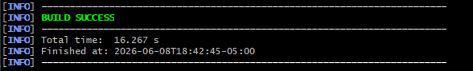
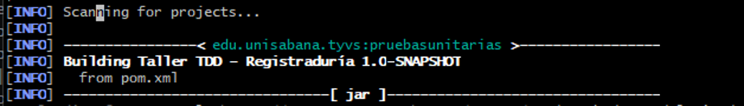
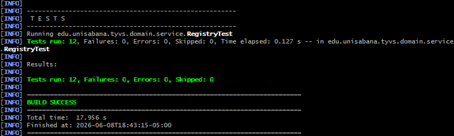
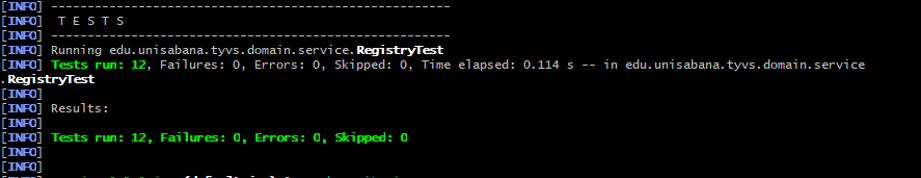
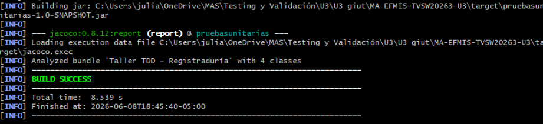
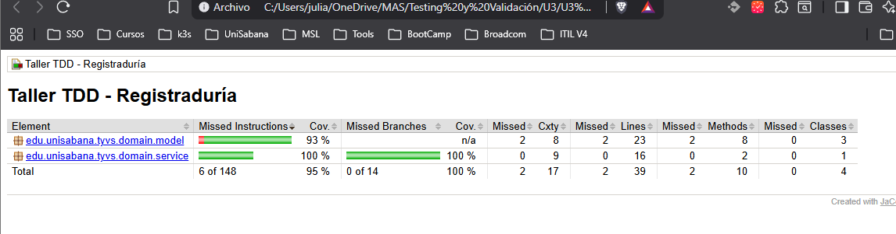
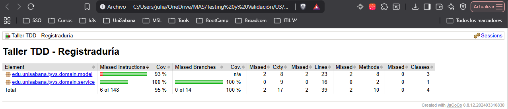

# Taller TDD — Sistema de Registro de Votantes (Registraduría)

> Proyecto de pruebas unitarias aplicando TDD, patrón AAA, clases de equivalencia, valores límite y BDD (Given–When–Then).

---

## Integrantes

- JULIAN DAVID CAICEDO PINEDA 

## Descripción del dominio

El sistema permite registrar personas que desean votar en las próximas elecciones. El servicio `Registry` valida cada solicitud según las siguientes **reglas de negocio**:

| Regla | Resultado |
|---|---|
| Persona null | `INVALID` |
| Id ≤ 0 | `INVALID` |
| Persona fallecida | `DEAD` |
| Edad < 0 o edad > 120 | `INVALID_AGE` |
| Edad < 18 | `UNDERAGE` |
| Id ya registrado | `DUPLICATED` |
| Cumple todos los requisitos | `VALID` |

---

## Estructura del proyecto

```
pruebasunitarias/
├── pom.xml
├── .gitignore
├── defectos.md
├── README.md
└── src/
    ├── main/java/edu/unisabana/tyvs/
    │   └── domain/
    │       ├── model/
    │       │   ├── Person.java
    │       │   ├── Gender.java
    │       │   └── RegisterResult.java
    │       └── service/
    │           └── Registry.java
    └── test/java/edu/unisabana/tyvs/
        └── domain/
            └── service/
                └── RegistryTest.java
```

---

## Historia TDD (Red → Green → Refactor)

### Iteración 1 — Camino feliz
- **RED:** Se escribe `shouldRegisterValidPerson()` → falla porque `Registry` no existe.
- **GREEN:** Se crea `Registry.registerVoter()` que devuelve `VALID` siempre.
- **REFACTOR:** Sin cambios estructurales necesarios aún.

### Iteración 2 — Persona fallecida y edades inválidas
- **RED:** Se agregan `shouldRejectDeadPerson()`, `shouldRejectNegativeAge()`, `shouldRejectInvalidAgeOver120()` → fallan porque no hay validaciones.
- **GREEN:** Se agrega verificación `!p.isAlive()` → DEAD, y rango de edad → INVALID_AGE.
- **REFACTOR:** Se extraen constantes `MIN_VOTING_AGE = 18` y `MAX_AGE = 120`.

### Iteración 3 — Id inválido y duplicados
- **RED:** Se agregan `shouldRejectWhenIdIsZero()`, `shouldRejectDuplicateRegistration()` → fallan.
- **GREEN:** Se agrega validación `id ≤ 0` → INVALID y `Set<Integer>` para detectar duplicados.
- **REFACTOR:** Se reordena el flujo de validaciones por prioridad de negocio.

### Iteración 4 — Valores límite 17/18 y múltiples registros
- **RED:** `shouldRejectUnderageAt17()`, `shouldAcceptAdultAt18()`, `shouldAcceptMaxAge120()`, `shouldAcceptTwoDistinctValidVoters()` → fallan.
- **GREEN:** La lógica ya cubre estos casos tras el refactor anterior.
- **REFACTOR:** Limpieza de comentarios y unificación del flujo de guardias.

---

## Clases de equivalencia y valores límite

| Clase | Entrada representativa | Valor límite | Resultado esperado | Prueba |
|---|---|---|---|---|
| Persona nula | `null` | — | `INVALID` | `shouldReturnInvalidWhenPersonIsNull` |
| Id inválido (cero) | `id = 0` | borde | `INVALID` | `shouldRejectWhenIdIsZero` |
| Id inválido (negativo) | `id = -5` | — | `INVALID` | `shouldRejectWhenIdIsNegative` |
| Persona fallecida | `alive = false` | — | `DEAD` | `shouldRejectDeadPerson` |
| Edad negativa | `age = -1` | borde inferior | `INVALID_AGE` | `shouldRejectNegativeAge` |
| Edad > máximo | `age = 121` | borde superior | `INVALID_AGE` | `shouldRejectInvalidAgeOver120` |
| Menor de edad | `age = 17` | borde de mayoría | `UNDERAGE` | `shouldRejectUnderageAt17` |
| Mayoría de edad exacta | `age = 18` | borde válido | `VALID` | `shouldAcceptAdultAt18` |
| Edad máxima válida | `age = 120` | borde superior | `VALID` | `shouldAcceptMaxAge120` |
| Duplicado | `id = 8008` (dos veces) | — | `DUPLICATED` | `shouldRejectDuplicateRegistration` |
| Persona válida | `age = 30, alive, id único` | — | `VALID` | `shouldRegisterValidPerson` |
| Dos personas distintas | `id = 9001, id = 9002` | — | `VALID, VALID` | `shouldAcceptTwoDistinctValidVoters` |

---

## Escenarios BDD (Given–When–Then)

```gherkin
Escenario 1: Rechazar persona null
  Dado (Given)  que la referencia a la persona es null
  Cuando (When) intento registrarla
  Entonces (Then) el resultado debe ser INVALID


Escenario 2: Rechazar persona fallecida
  Dado (Given)  que existe una persona con alive = false
  Cuando (When) intento registrarla
  Entonces (Then) el resultado debe ser DEAD

Escenario 3: Rechazar menor de edad
  Dado (Given)  que existe una persona viva de 17 años con id válido
  Cuando (When) intento registrarla
  Entonces (Then) el resultado debe ser UNDERAGE

Escenario 4: Aceptar mayoría de edad exacta
  Dado (Given)  que existe una persona viva de exactamente 18 años con id válido
  Cuando (When) intento registrarla
  Entonces (Then) el resultado debe ser VALID

Escenario 5: Rechazar edad fuera de rango biológico
  Dado (Given)  que existe una persona viva con 121 años
  Cuando (When) intento registrarla
  Entonces (Then) el resultado debe ser INVALID_AGE

Escenario 6: Rechazar registro duplicado
  Dado (Given)  que ya existe una persona registrada con id = 8008
  Cuando (When) intento registrar otra persona con el mismo id
  Entonces (Then) el resultado debe ser DUPLICATED
```

---

## Ejecución

### Compilar
```bash
mvn clean compile
```
**

### Ejecutar pruebas
```bash
mvn clean test
```
**
**
### Generar reporte de cobertura JaCoCo
```bash
mvn clean verify
```
**
**

El reporte se genera en: `target/site/jacoco/index.html`
**
---

## Cobertura de código (JaCoCo)


**Cobertura esperada:** ≥ 80% en el paquete `domain`.

*()*

---

## Defectos

Ver archivo [`defectos.md`](./defectos.md) para el registro completo de defectos detectados durante el desarrollo.

---

## Reflexión final

**¿Qué escenarios no se cubrieron y por qué?**
- Validación del campo `name` (null o vacío) — no forma parte de los requerimientos actuales del dominio.
- Género `UNIDENTIFIED` — no hay regla de negocio diferenciada para este valor.

**¿Qué defectos reales detectaron las pruebas?**
- Ausencia de validación de límites de edad (DEF-001, DEF-002).
- Falta de control de ids inválidos y duplicados (DEF-003, DEF-004).

**¿Cómo mejorarías `Registry` para facilitar su prueba?**
- Inyectar el repositorio de ids como dependencia (puerto/adaptador) para facilitar el testing sin estado interno.
- Extraer las validaciones a un `PersonValidator` separado para mayor cohesión.
